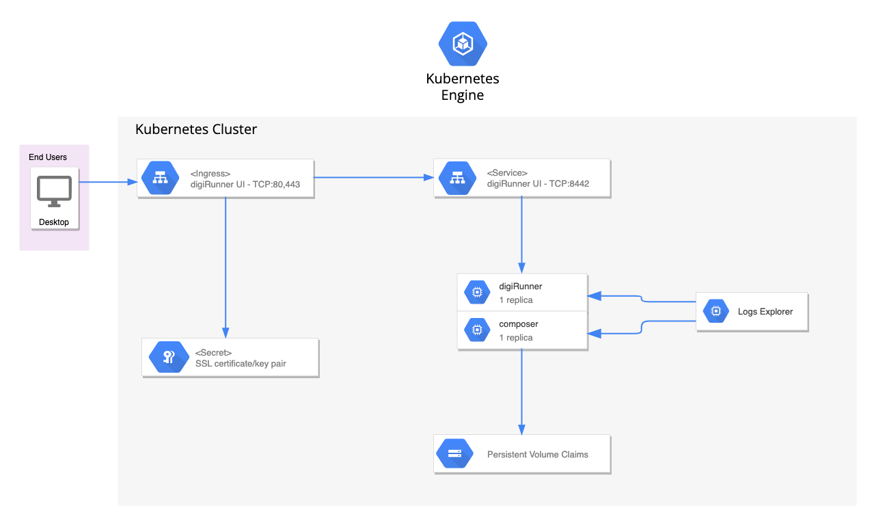

# Overview

digiRunner Enterprise API Management Platform features full API lifecycle management in compliance with OpenAPI specification and security standards of OAuth2.0 and OIDC. Tailored for Open Banking, Smart Government and enterprise system integration, it provides a secure environment for API management, analysis, deployment and more to empower API-First strategy..

For more information on digiRunner, visit the
[official digiRunner website](https://www.tpisoftware.com/en/products/digirunner).

## About Google Click to Deploy

Popular open source software stacks on Kubernetes, packaged by Google.

## Architecture



This solution installs a single instance of digiRunner on your Kubernetes
cluster.

The digiRunner Pod is managed by a Deployment, with the number of replicas set
to 1. The digiRunner Pod uses a PersistentVolume to store data and an Ingress to
expose the UI to external users. If you need to limit access to the digiRunner UI,
you must configure Google Cloud firewall rules.

# Installation

## Quick install with Google Cloud Marketplace

Get up and running with a few clicks! To install this Jenkins app to a Google
Kubernetes Engine cluster using Google Cloud Marketplace, follow the
[on-screen instructions](https://console.cloud.google.com/marketplace/details/google/digirunner-standalone).

## Command-line instructions

You can use [Google Cloud Shell](https://cloud.google.com/shell/) or a local
workstation to complete these steps.

[](https://console.cloud.google.com/cloudshell/editor?cloudshell_git_repo=https://github.com/butterpigpig001/digiRunner&cloudshell_open_in_editor=README.md)

### Prerequisites

#### Set up command-line tools

You'll need the following tools in your environment. If you are using Cloud
Shell, `gcloud`, `kubectl`, Docker, and Git are installed in your environment by
default.

-   [gcloud](https://cloud.google.com/sdk/gcloud/)
-   [kubectl](https://kubernetes.io/docs/tasks/tools/install-kubectl/)
-   [docker](https://docs.docker.com/install/)
-   [git](https://git-scm.com/book/en/v2/Getting-Started-Installing-Git)
-   [helm](https://helm.sh/)

Configure `gcloud` as a Docker credential helper:

```shell
gcloud auth configure-docker
```

#### Create a Google Kubernetes Engine cluster

Create a cluster from the command-line. If you already have a cluster that you
want to use, skip this step.

```shell
export CLUSTER=digirunner-cluster
export ZONE=us-west1-a
export MACHINE=n2d-standard-2
```

```shell
gcloud container clusters create "$CLUSTER" --zone "$ZONE" --num-nodes=1 --machine-type="$MACHINE"
```

#### Configure `kubectl` to connect to the cluster

```shell
gcloud container clusters get-credentials "$CLUSTER" --zone "$ZONE"
```

#### Clone this repo

Clone this repo and its associated tools repo:

```shell
git clone --recursive https://github.com/butterpigpig001/digiRunner.git
```

#### Install the Application resource definition

An Application resource is a collection of individual Kubernetes components,
such as Services, Deployments, and so on, that you can manage as a group.

To set up your cluster to understand Application resources, run the following
command:

```shell
kubectl apply -f "https://raw.githubusercontent.com/GoogleCloudPlatform/marketplace-k8s-app-tools/master/crd/app-crd.yaml"
```

You need to run this command once for each cluster.

The Application resource is defined by the
[Kubernetes SIG-apps](https://github.com/kubernetes/community/tree/master/sig-apps)
community. The source code can be found on
[github.com/kubernetes-sigs/application](https://github.com/kubernetes-sigs/application).

### Install the app

Navigate to the `digiRunner` directory:

```shell
cd digiRunner
```

#### Configure the app with environment variables

Choose an instance name and
[namespace](https://kubernetes.io/docs/concepts/overview/working-with-objects/namespaces/)
for the app. In most cases, you can use the `default` namespace.

```shell
export APP_INSTANCE_NAME=digirunner-1
export NAMESPACE=default
```

For the persistent disk provisioning of the Jenkins application StatefulSets, you will need to:

 * Set the StorageClass name. Check your available options using the command below:
   * ```kubectl get storageclass```
   * Or check how to create a new StorageClass in [Kubernetes Documentation](https://kubernetes.io/docs/concepts/storage/storage-classes/#the-storageclass-resource)

 * Set the persistent disk's size. The default disk size is "1Gi".

```shell
export DGR_STORAGE_CLASS="standard-rwo" # provide your StorageClass name if not "standard"
export DGR_PERSISTENT_DISK_SIZE="1Gi"
```

Configure the container images:

```shell
export IMAGE_TAG=4.5.10-2
export IMAGE_DGR_REPO="gcr.io/tpisoftware-digirunner-public/digirunner/digirunner"
export IMAGE_COMPOSER_REPO="gcr.io/tpisoftware-digirunner-public/digirunner/composer"
```

The image above is referenced by
[tag](https://docs.docker.com/engine/reference/commandline/tag). We recommend
that you pin each image to an immutable
[content digest](https://docs.docker.com/registry/spec/api/#content-digests).
This ensures that the installed app always uses the same images, until
you are ready to upgrade.

#### Expand the manifest template

Use `helm template` to expand the template. We recommend that you save the
expanded manifest file for future updates to your app.

```shell
helm template $APP_INSTANCE_NAME chart/digiRunner \
  --namespace $NAMESPACE \
  --set "app.image.dgr.repo=$IMAGE_DGR_REPO" \
  --set "app.image.dgr.tag=$IMAGE_TAG" \
  --set "app.image.composer.repo=$IMAGE_COMPOSER_REPO" \
  --set "app.image.composer.tag=$IMAGE_TAG" \
  --set "app.persistentVolumeClaim.storageClass=$DGR_STORAGE_CLASS" \
  --set "app.persistentVolumeClaim.size=$DGR_PERSISTENT_DISK_SIZE" \
  > ${APP_INSTANCE_NAME}_manifest.yaml
```

#### Apply the manifest to your Kubernetes cluster

Use `kubectl` to apply the manifest to your Kubernetes cluster. This
installation creates:

-   An Application resource, which collects all the deployment resources into
    one logical entity.
-   A PersistentVolume and PersistentVolumeClaim. If an installation is deleted, the
    volume is not deleted with it. If you delete an installation, then recreate it
    with the same name, the new installation will use the same PersistentVolume. As
    a result, there will be no app initialization, and the old configuration will
    be used.
-   An Services, which expose digiRunner UI (80)
-   An Ingress, which exposes the digiRunner UI externally.

```shell
kubectl apply -f "${APP_INSTANCE_NAME}_manifest.yaml" --namespace "${NAMESPACE}"
```

#### View the app in the Google Cloud Console

To get the Cloud Console URL for your app, run the following command:

```shell
echo "https://console.cloud.google.com/kubernetes/application/${ZONE}/${CLUSTER}/${NAMESPACE}/${APP_INSTANCE_NAME}"
```

To view the app, open the URL in your browser.

# Using the app

## Sign in to your new Jenkins instance

To sign in to Jenkins, get the Jenkins HTTP/HTTPS address and the Jenkins master
Pod name:

```shell
EXTERNAL_IP=$(kubectl -n$NAMESPACE get ingress -l "app.kubernetes.io/name=$APP_INSTANCE_NAME" \
  -ojsonpath="{.items[0].status.loadBalancer.ingress[0].ip}")
MASTER_POD=$(kubectl -n$NAMESPACE get pod -oname | sed -n /\\/$APP_INSTANCE_NAME-jenkins/s.pods\\?/..p)

echo http://$EXTERNAL_IP/dgrv4/login
```

When you access your cluster using HTTPS, you might have to accept a temporary
certificate.

## Follow the on-screen steps

To set up Jenkins and customize your installation, follow these on-screen steps:

*   Install plugins
*   Create the first admin user
*   Optionally, configure the Jenkins URL; you can also change the URL later

# Logging and monitoring

This digiRunner installation logs to
[Stackdriver](https://cloud.google.com/monitoring/).

# Deleting your digiRunner installation

> Warning: The following command deletes digiRunner from your cluster. If you need
> your data, back it up first.

```shell
kubectl delete -f ${APP_INSTANCE_NAME}_manifest.yaml --namespace $NAMESPACE
```